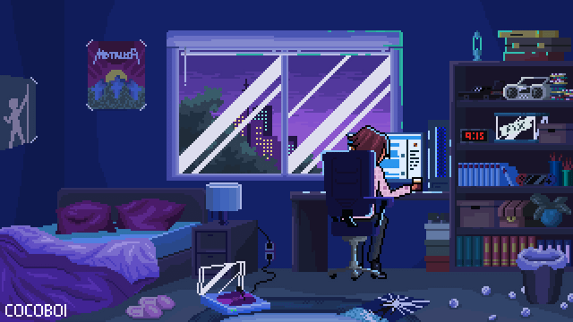

  

<h1 align="center"> 
  
</h1>

---

<h3 align="center"> 
✨ Undergraduate IT Student @ Rajarata University of Sri Lanka ✨    
💡 Passionate about software engineering, open-source, and creating innovative solutions.  
</h3>  

---

  

---

## 🎓 Education  

- 🎓 **B.Sc in Information Technology** 
- 📍 Rajarata University of Sri Lanka  

---

## 🛠️ Tech Arsenal  

  
## 💻 Languages

  
  
  
  
  
  
 
  
  

## ⚙️ Frameworks & Libraries

  
  
  
  
  
  
  
  

## 🗄️ Databases

  
  

## 🛠 Tools & Platforms

  
  
  
  
  
  
  

---

## 🚀 About Me  

- 🔭 Currently working on **open-source projects** & **personal apps**  
- 🌱 Learning **cloud, AI, and advanced system design**  
- 👯 Love collaborating on **open-source & research projects**  
- 💬 Ask me about **Web, Software & Open-Source contributions**  
- 📧 Reach me: [piumimjha@gmail.com](mailto:piumimjha@gmail.com)  
- 😄 Pronouns: *She/Her*  
- ⚡ Fun fact: 🌍 Love **traveling, music, and exploring nature**  

---

## 📊 GitHub Analytics  

  
  
  

---

## 📈 Activity Graph  

  

---

---

  

---

## 📫 Connect With Me  

  
  
  

  

---

  
✨ Thanks for stopping by!  
⚡ Let’s connect & create something amazing 🚀  
💡 *“Code is like humor. When you have to explain it, it’s bad.”*  

